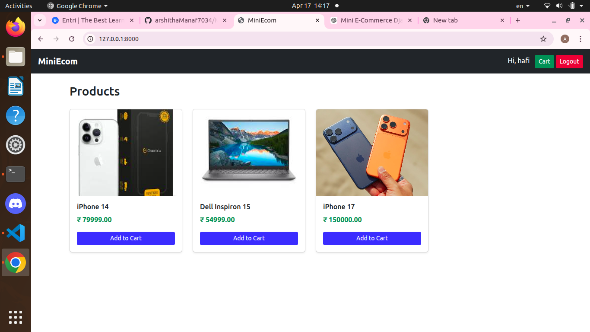
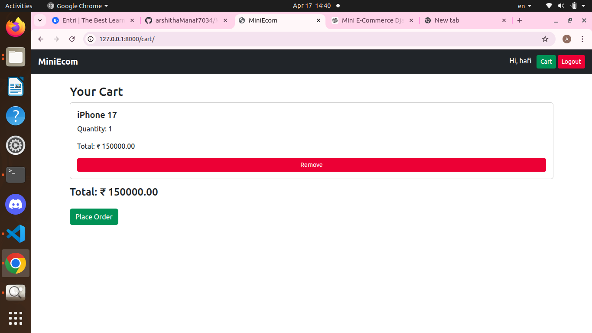
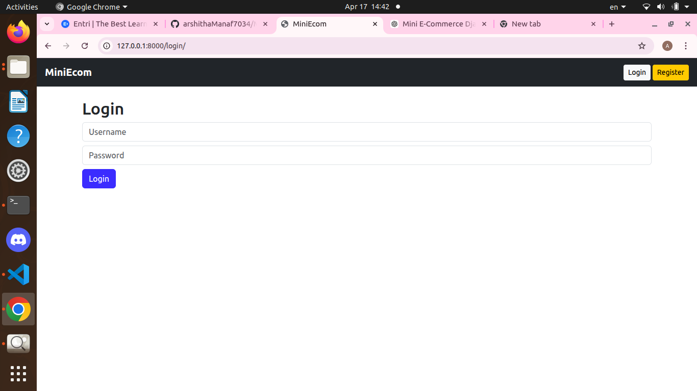
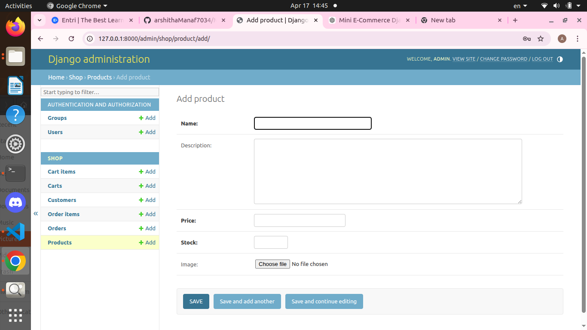

# 🛒 Mini E-Commerce Platform (Advanced Django)

A fully functional e-commerce web application built using Django with session management, REST APIs, and authentication.

---

## 🚀 Features

### 👤 Authentication
- User Registration & Login
- Logout functionality
- Session-based authentication

### 🛍️ Product Management
- View all products
- Product detail page
- Admin product management

### 🛒 Cart System
- Add to cart (session-based)
- Remove from cart
- Dynamic cart total

### 💳 Checkout System
- Convert cart → Order
- Store OrderItems
- Clear cart after checkout

### 🔁 CRUD Operations
- Add product (frontend)
- Admin CRUD support

### 🌐 REST API (Django REST Framework)
- View all products → `/api/products/`
- View product → `/api/products/<id>/`
- View orders → `/api/orders/`
- Create order via API

### 🔐 API Security
- Token-based authentication
- Protected endpoints

---

## 🖼️ Screenshots

### 🏠 Home Page


### 🛒 Cart Page


### 🔐 Login Page


### ⚙️ Admin Panel


### 📡 API Response


---

## 🛠️ Tech Stack

- Python
- Django
- Django REST Framework
- SQLite
- Bootstrap

---

## ⚙️ Installation

```bash
git clone https://github.com/YOUR_USERNAME/MiniEcom-Advanced.git
cd MiniEcom-Advanced

python3 -m venv venv
source venv/bin/activate

pip install django djangorestframework

python manage.py migrate
python manage.py runserver
